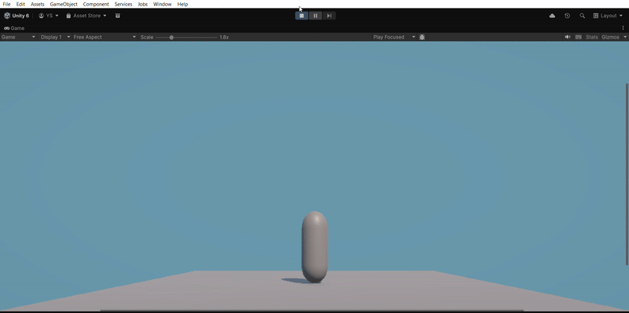

# Unity: Particle & Audio Interaction Study

A study project focused on synchronizing Particle Systems and Audio with physics-based events in Unity 6.2.

## 🎯 Features:
* Synchronized visual (Splash) and sound effects on impact.
* Event handling via `OnCollisionEnter` and `OnTriggerEnter`.
* Using `CompareTag` for reliable object identification.
* Basic object lifecycle management (Destroy logic).

## 🛠 Tech Stack:
* **Engine:** Unity 6.2
* **VFX:** Particle System
* **Audio:** AudioSource
* **Scripting:** C#

## 📺 Demo

